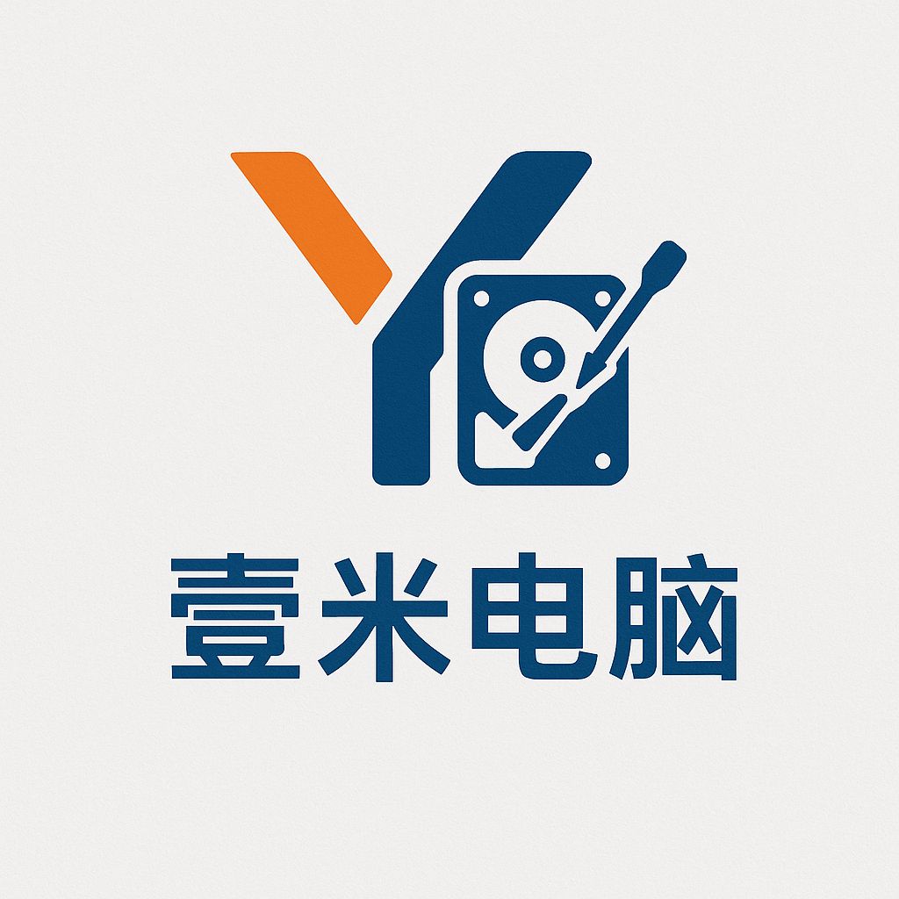

<!DOCTYPE html>
<html lang="zh-CN">
<head>
  <meta charset="UTF-8" />
  <meta name="viewport" content="width=device-width, initial-scale=1.0" />
  <title>壹米说电脑</title>

  

  <!-- 粒子效果库 -->
  

</head>

<body>

  

  <header>
    
    <h1>壹米说电脑</h1>
    
专注电脑硬件｜系统技巧｜维修经验分享

  </header>

  

    

      <h2>个人简介</h2>
      
从事电脑维修行业多年，坚持分享真实实用的电脑知识与技巧。

    

    

      <h2>技能特长</h2>

      

        
电脑维修

        
维修故事案例

        
硬件评测

        

        <h3> 壹米说电脑工具箱</h3>
        
电脑维修检测、各种常用软件、定制工具箱

        <a href="https://pan.baidu.com/s/1rs0AVBK9UjF9YFB-yZfFww?pwd=zhxc" target="_blank" rel="noopener noreferrer">网盘下载</a>

        

        <h3>软件技巧分享</h3>
        
壹米说电脑分享的软件合集

        <a href="https://pan.baidu.com/s/5K19zjFNfDDXftIR3TrgSlA" target="_blank" rel="noopener noreferrer">知识库</a>

        
系统重装与优化

      

    

    

      <h2>精选项目</h2>

      

        

          <h3>公众号</h3>
          
提供最新的维修技巧与硬件知识。

          <a href="https://mp.weixin.qq.com/s/havu_WZ8Miv27NmwWuRsOw" target="_blank" rel="noopener noreferrer">查看文章</a>
        

        

          <h3>今日头条号</h3>
          
发布电脑技术相关视频内容

          <a href="https://www.toutiao.com/c/user/token/Cia_1cp4wTlFYV0nDzG1WckdQlQJQoI7aqen6BgMhWbgqGGSHtqUiRpJCjwAAAAAAAAAAAAAT791-tpl6KJg312RKFVizIbYlxK9n0ePMWFfIg7SNXzUANYlMEt0V4rIlV11SZb5v_oQ_6aCDhjDxYPqBCIBA9CBvLQ=/?source=list&log_from=ac989b9e65c1a_1763894140325" target="_blank" rel="noopener noreferrer">查看视频</a>
        

        

          <h3>电脑维修服务</h3>
          
线上/线下全方位电脑维修服务

          
1039696919@qq.com

        

      

    

    <!-- 二维码 section -->
    

      <h2>关注「壹米说电脑」公众号</h2>
      
      
获取更多电脑技巧与实用工具

    

  

  
© 2025 壹米说电脑

  <!-- 粒子配置 -->
  

</body>
</html>

